# Automated build

## flow
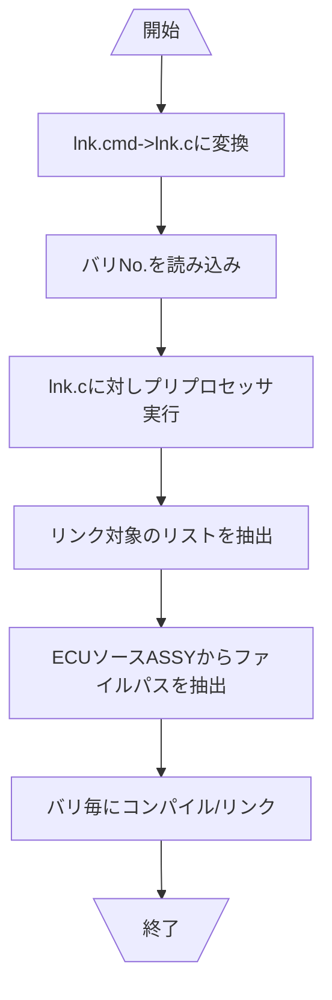

### lnk.cmd->lnk.cに変換


---

## References
### Mermaid
#### Flowcharts

##### A node (default)

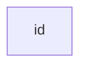

##### A node with text


##### Graph
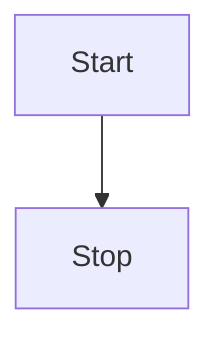


#### Node shapes
**A node with round edges**

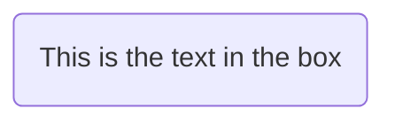

**A stadium-shaped node**


**A node in a subroutine shape**

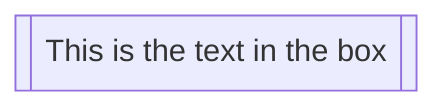

**A node in a cylindrical shape**

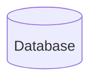

**A node in the form of a circle**

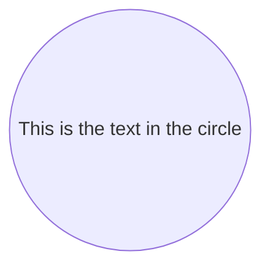

**A node in an asymmetric shape**

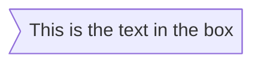

**A node (rhombus)**

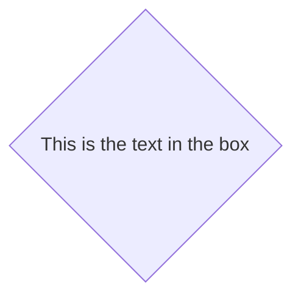

**A hexagon node**


**Parallelogram**

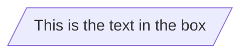

**Parallelogram alt**

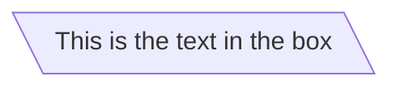

**Trapezoid**

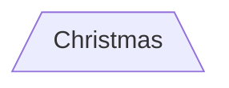

**Trapezoid alt**

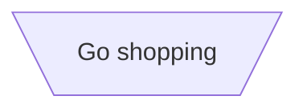

##### Links between nodes

**A link with arrow head**

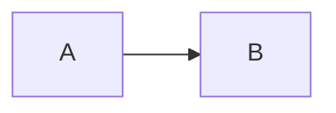

**An open link**

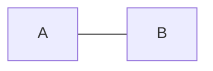

**Text on links**

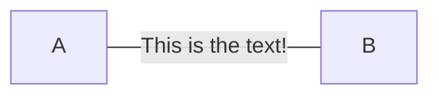

or

```mermaid
graph LR
    A---|This is the text|B
```

**A link with arrow head and text**

```mermaid
graph LR
    A-->|text|B
```

or

```mermaid
graph LR
    A-- text -->B
```

**Dotted link**

```mermaid
graph LR;
   A-.->B;
```

**Dotted link with text**

```mermaid
graph LR
    A-. text .-> B
```

**Thick link**

```mermaid
graph LR
    A ==> B
```

**Thick link with text**

```mermaid
graph LR
    A == text ==> B
```

**Chaining of links**

```mermaid
graph LR
    A -- text --> B -- text2 --> C
```


```mermaid
graph LR
    a --> b & c--> d
```

```mermaid
graph TB
    A & B--> C & D
```

**Beta: New arrow types**

```mermaid
flowchart LR
    A --o B
    B --x C
```

**Beta: Multi directional arrows**

```mermaid
flowchart LR
    A o--o B
    B <--> C
    C x--x D
```

**Minimum length of a link**

```mermaid
graph TD
    A[Start] --> B{Is it?};
    B -->|Yes| C[OK];
    C --> D[Rethink];
    D --> B;
    B ---->|No| E[End];
```

****

```mermaid
graph TD
    A[Start] --> B{Is it?};
    B -- Yes --> C[OK];
    C --> D[Rethink];
    D --> B;
    B -- No ----> E[End];
```

|Length            | 1    | 2     | 3      |
|------------------|------|-------|--------|
|Normal            | ---  | ----  | -----  |
|Normal with arrow | -->  | --->  | ---->  |
|Thick             | ===  | ====  | =====  |
|Thick with arrow  | ==>  | ===>  | ====>  |
|Dotted            | -.-  | -..-  | -...-  |
|Dotted with arrow | -.-> | -..-> | -...-> |


**Special characters that break syntax**

```mermaid
graph LR
    id1["This is the (text) in the box"]
```

**Entity codes to escape characters**

```mermaid
graph LR
    A["A double quote:#quot;"] -->B["A dec char:#9829;"]
```

**Subgraphs**

```mermaid
graph TB
    c1-->a2
    subgraph one
    a1-->a2
    end
    subgraph two
    b1-->b2
    end
    subgraph three
    c1-->c2
    end
```


```mermaid
graph TB
    c1-->a2
    subgraph ide1 [one]
    a1-->a2
    end
```

**Beta: flowcharts**

```mermaid
flowchart TB
    c1-->a2
    subgraph one
    a1-->a2
    end
    subgraph two
    b1-->b2
    end
    subgraph three
    c1-->c2
    end
    one --> two
    three --> two
    two --> c2
```

**Styling a node**

```mermaid
graph LR
    id1(Start)-->id2(Stop)
    style id1 fill:#f9f,stroke:#333,stroke-width:4px
    style id2 fill:#bbf,stroke:#f66,stroke-width:2px,color:#fff,stroke-dasharray: 5 5
```

**Graph declarations with spaces between vertices and link and without semicolon**

```mermaid
graph LR
    A[Hard edge] -->|Link text| B(Round edge)
    B --> C{Decision}
    C -->|One| D[Result one]
    C -->|Two| E[Result two]
```

